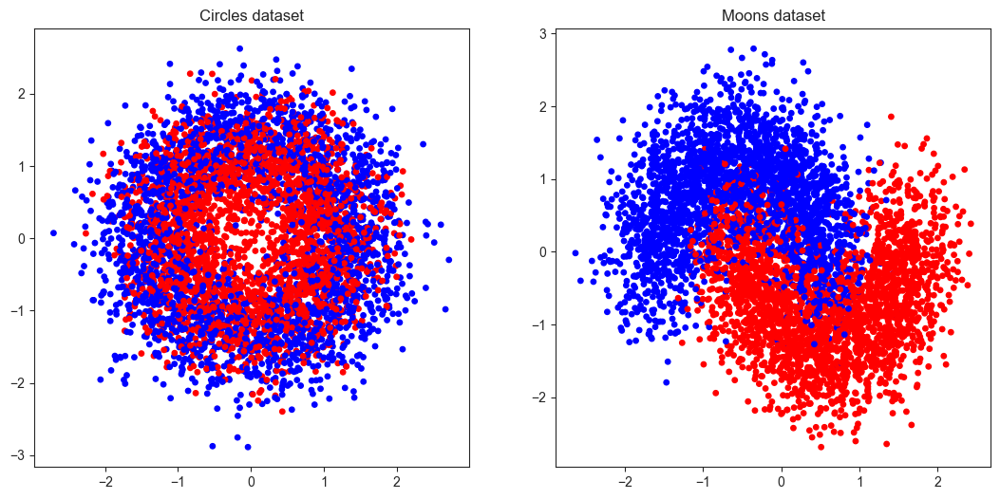
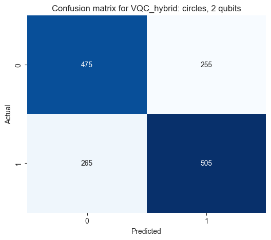
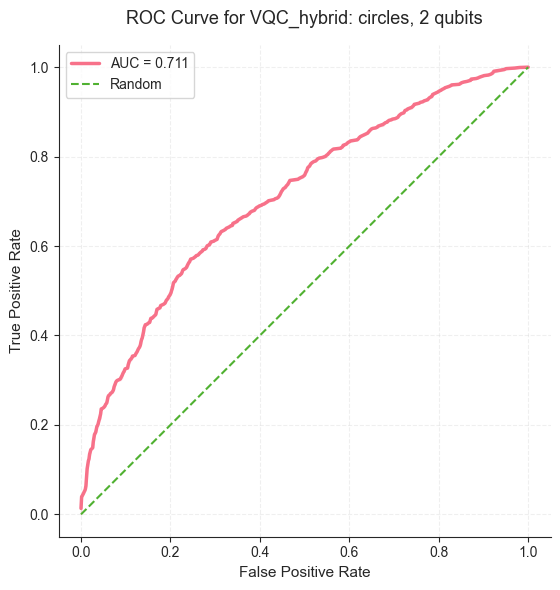
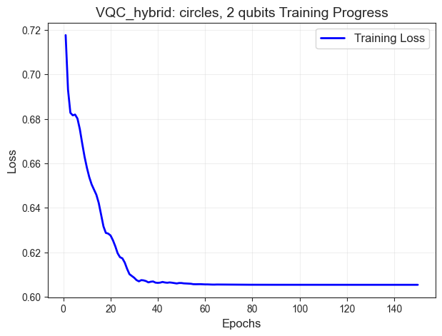
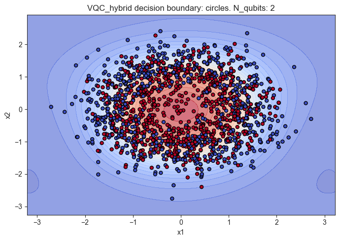
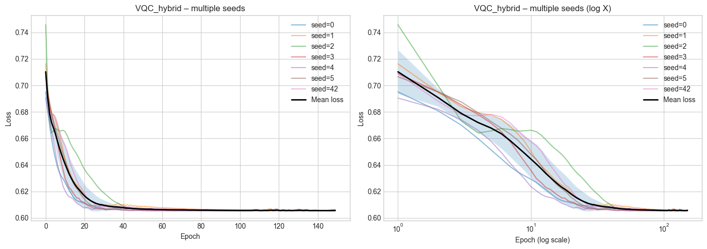
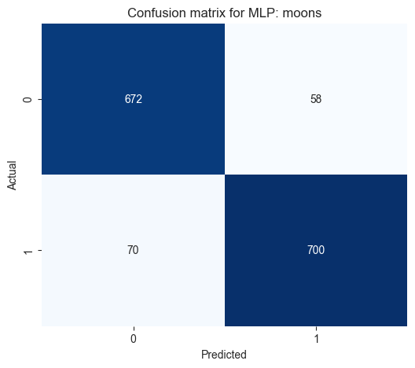
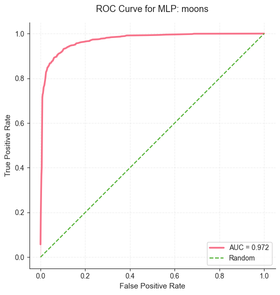
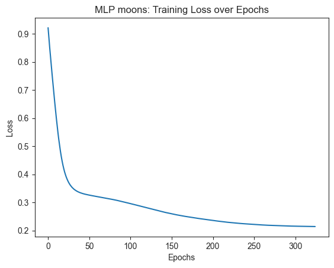

<div align="center">

# Quantum vs Classical: A Comparative Study of Variational Quantum Classifiers and Neural Networks on Synthetic Data

## Квант против классики: Сравнительное исследование вариационных квантовых классификаторов и нейросетей на синтетических данных

</div>


## О проекте

Проект исследует производительность **Variational Quantum Classifier (VQC)**, его гибридной версии **VQC_hybrid** и классической нейросети **MLP** на синтетических датасетах `Circles` и `Moons`.
Основная цель — понять, в каких задачах квантовая модель может быть конкурентоспособной с классической нейросетью и как архитектура и параметры модели (например, число кубитов) влияют на результаты.

### Цели

1. Сравнить точность классификации MLP и квантовых моделей на простых синтетических датасетах.
2. Исследовать влияние архитектуры VQC (чистый квантовый слой vs гибридный) на эффективность.
3. Проверить, как число кубитов (`n_qubits`) влияет на выражаемость модели и качество классификации.
4. Визуализировать зависимость границы решений и кривых AUC для разных моделей.

### Задачи

* Обучить три модели на `Circles` и `Moons`.
* Посчитать метрики: **Accuracy** и **ROC AUC**.
* Построить графики: Confusion Matrix, ROC-кривая, Training Plot, Decision Boundary.
* Сформулировать математическое обоснование поведения моделей и интерпретировать зависимость метрик от архитектуры и числа кубитов.

---

## Метрики

* **Accuracy**:

$$
\mathrm{Accuracy} = \frac{TP + TN}{TP + TN + FP + FN}
$$

* **ROC AUC**:

$$
\mathrm{AUC} = \int_0^1 TPR(FPR), d(FPR), \quad
TPR = \frac{TP}{TP + FN}, \quad
FPR = \frac{FP}{FP + TN}
$$

ROC AUC интерпретируется как вероятность того, что случайный положительный объект получит больший прогнозный скор, чем случайный отрицательный:

$$
\mathrm{AUC} = \mathbb{P}(s(x^+) > s(x^-))
$$

---

## Датасет Circles

* Радиальная структура:

$$
x_1^2 + x_2^2 = r^2
$$

* **Лучшие результаты:** `VQC_hybrid` (ROC AUC ≈ 0.711, Accuracy ≈ 0.653)
* MLP почти случайная (ROC AUC ≈ 0.537)

### Математическое обоснование

В VQC_hybrid квантовый слой выполняет **feature mapping**:

$$
x \mapsto U(x) |0\rangle
$$

и вычисляет ожидаемое значение наблюдаемой:

$$
\phi(x) = \langle 0 | U^\dagger(x) O U(x) | 0 \rangle
$$

где (U(x)) — параметризованная квантовая схема (AngleEmbedding + Ansatz), (O) — измеряемый оператор.
Квантовое ядро:

$$
K(x_i, x_j) = |\langle \psi(x_i) | \psi(x_j) \rangle|^2
$$

позволяет моделировать **сложные нелинейные зависимости между объектами**, что делает VQC_hybrid более выразительной для радиально-симметричных классов.

Вот исправленный вариант с корректным LaTeX для GitHub Markdown, где все формулы будут работать, а текст сохранён полностью:

---

#### Что такое Ansatz:

**Описание:**
Ansatz — это параметризованная квантовая схема, которая формирует вариационное квантовое состояние и позволяет модели учиться сложным зависимостям в данных. В `VQC_hybrid` используется `StronglyEntanglingLayers`, обеспечивающий как индивидуальные вращения кубитов, так и их перепутывание. Этот слой отвечает за создание выразительных квантовых признаков, которые затем передаются в классический слой для классификации, повышая способность модели различать сложные закономерности в данных.

**Локальные вращения кубитов:**
Каждый кубит (i) подвергается последовательным вращениям по осям X, Y и Z:

```math
R_i(\theta_i) = R_X(\theta_i^x) R_Y(\theta_i^y) R_Z(\theta_i^z)
```

Эти вращения позволяют изменять состояние кубита на сфере Блоха произвольно, создавая разнообразные квантовые суперпозиции.

**Энтанглирование:**
После локальных вращений кубиты перепутываются многокубитными вентилями, формируя корреляции между ними. Это критично для моделирования сложных зависимостей и нелинейных отношений в данных.

**Слои Ansatz:**
Схема повторяется в (L) слоях, формируя итоговую трансформацию:

```math
U(\Theta) = \prod_{l=1}^{L} \Big(\text{EntangleLayer} \cdot \bigotimes_i R_i(\theta_i^{(l)}) \Big)
```

где (\Theta) — набор всех параметров, которые оптимизируются в процессе обучения.

**Кодирование входных данных и выход:**
Входные данные (\mathbf{x}) кодируются через AngleEmbedding:

```math
|\psi_0\rangle = \bigotimes_i R_Y(x_i) |0\rangle
```

Ansatz преобразует это состояние в:

```math
|\psi(\Theta)\rangle = U(\Theta) |\psi_0\rangle
```

Измерения:

```math
\langle Z_i \rangle
```

Квантовый слой с Ansatz создаёт выразительные и коррелированные признаки данных, которые усиливают классическую часть модели, обеспечивая гибридное квантово-классическое обучение и позволяя эффективно распознавать сложные и нелинейные зависимости в данных.

---

#### Почему VQC_hybrid лучше MLP

1. **Нелинейное расширение пространства признаков**

В исходном пространстве (\mathbb{R}^2) классы не являются линейно разделимыми.
Квантовый слой выполняет отображение:

```math
\mathbb{R}^2 \rightarrow \mathcal{H}, \quad \dim(\mathcal{H}) = 2^{n_{qubits}}
```

Даже при (n_{qubits}=2) пространство признаков становится существенно богаче.
Радиальная зависимость (x_1^2 + x_2^2) может быть представлена через тригонометрические комбинации углов поворота кубитов.

В результате линейный классический слой после квантового блока фактически работает в уже **нелинейно преобразованном пространстве**, что даёт преимущество над небольшой MLP.

2. **Энтанглирование как источник коррелированных признаков**

Благодаря слоям перепутывания (entanglement) признаки становятся зависимыми друг от друга.
Это позволяет квантовой схеме моделировать взаимодействия вида:

```math
f(x_1, x_2) \neq f_1(x_1) + f_2(x_2)
```

Для задачи Circles именно такие совместные нелинейные зависимости критичны, поскольку принадлежность к классу определяется радиусом, а не линейной комбинацией координат.

Простая MLP с малым числом нейронов может не выучить эту структуру, тогда как квантовый feature map изначально задаёт нелинейную геометрию пространства.

---

#### Почему результаты гибридной модели всё ещё низкие

Несмотря на архитектурное преимущество, метрики остаются умеренными. Это объясняется несколькими факторами.

1. **Высокий уровень шума**

При параметре `noise = 0.3` классы существенно перекрываются. Это означает, что существует область, где:

```math
P(y=1 \mid x) \approx 0.5
```

Даже идеальный классификатор в такой зоне не сможет достичь высокой Accuracy.
Шум ограничивает верхнюю границу качества.

2. **Ограниченная выразительность схемы**

При фиксированном числе кубитов и слоёв Ansatz множество реализуемых функций ограничено:

```math
\mathcal{F}_{VQC} \subsetneq \mathcal{F}_{all}
```

Если глубина схемы мала, модель не способна точно аппроксимировать сложную и шумную границу разделения.

3. **Ограниченность классической части**

После квантового блока используется один линейный слой:

```math
\hat{y} = \sigma(W \phi(x) + b)
```

Если квантовые признаки частично перекрываются для разных классов, одного линейного преобразования недостаточно для точного разделения.

4. **Сложность оптимизации**

При увеличении числа кубитов и параметров градиенты могут уменьшаться (эффект barren plateau), что ухудшает поиск глобального минимума и ограничивает достижимое качество.


Таким образом:

* VQC_hybrid превосходит MLP, потому что квантовый слой создаёт более подходящее нелинейное представление для радиальной структуры.
* Однако архитектурные ограничения, шум в данных и сложности оптимизации не позволяют модели достичь высокой AUC.
* Рост числа кубитов без увеличения глубины или усложнения классической части не приводит к заметному улучшению.

--- 

### Влияние числа кубитов

Число кубитов расширяет размерность пространства признаков:

$$
n_{qubits} \uparrow \implies \dim(\mathcal{H}) = 2^{n_{qubits}} \uparrow
$$

Однако для задачи Circles:

$$
\frac{\partial \mathrm{AUC}}{\partial n_{qubits}} \approx 0
$$

то есть **2 кубитов уже достаточно**, дальнейший рост числа кубитов не даёт значимого улучшения.

---

## Датасет Moons

* Гладкая нелинейная граница:

$$
f(x) = \sigma\big(W_2 , \sigma(W_1 x + b_1) + b_2\big)
$$

* **Лучшие результаты:** MLP (ROC AUC ≈ 0.972, Accuracy ≈ 0.915)
* VQC_hybrid хуже (AUC ≈ 0.884), VQC уступает ещё сильнее

### Математическое объяснение

MLP аппроксимирует гладкую функцию разделения классов, используя последовательность линейных и нелинейных преобразований. Квантовые модели с ограниченным числом кубитов и слоёв Ansatz имеют меньшую способность к гладкой аппроксимации и могут сталкиваться с:

* **Barren plateau** — затухание градиентов при увеличении числа кубитов
* **Ограниченная выразительность** - ограниченная выразительность означает, что при фиксированном числе кубитов и слоёв квантовая схема может реализовать только ограниченное множество форм разделяющей границы. На задаче Circles её нелинейное feature mapping помогает лучше разделять радиальную структуру данных. Однако на Moons граница более плавная и требует гибкой аппроксимации, и здесь MLP оказывается мощнее: она может точнее «подогнать» форму разделяющей поверхности, тогда как VQC ограничена своей архитектурой и потому уступает по AUC.

### Влияние числа кубитов

Для Moons рост числа кубитов:

$$
n_{qubits}: 2 \to 4 \to 8 \implies \text{Accuracy снижается у VQC}
$$

Это демонстрирует, что **увеличение размерности без дополнительного классического слоя** не всегда улучшает качество.

---

## Визуализация результатов

Для каждой задачи показаны **только лучшие модели**:

* Circles → `VQC_hybrid`
* Moons → `MLP`

### Распределение данных




<table>
<tr>
<td>

#### Circles — Distribution Metrics

| Метрика                     | Значение |
| --------------------------- | -------- |
| radial_overlap              | 0.659320 |
| bayes_error_approx          | 0.329660 |
| bayes_accuracy_upper_bound  | 0.670340 |
| mean_margin                 | 0.360847 |
| std_margin                  | 0.266876 |
| near_boundary_fraction_<0.1 | 0.169600 |
| class0_radial_variance      | 0.171138 |
| class1_radial_variance      | 0.169689 |
| fisher_ratio                | 0.364050 |

</td>
<td>

#### Moons — Distribution Metrics

| Метрика                     | Значение |
| --------------------------- | -------- |
| kde_overlap                 | 0.007559 |
| bayes_error_approx          | 0.003779 |
| bayes_accuracy_upper_bound  | 0.996221 |
| mean_margin                 | 1.370841 |
| std_margin                  | 0.752458 |
| near_boundary_fraction_<0.1 | 0.023600 |
| class0_variance_sum         | 2.473090 |
| class1_variance_sum         | 1.526838 |
| fisher_ratio                | 0.000036 |

</td>
</tr>
</table>


---

#### Краткое описание метрик распределения (Circles)

* **radial_overlap**
  Интеграл перекрытия радиальных плотностей классов.
  Показывает степень статистической неразличимости по радиусу.

* **bayes_error_approx**
  Приближённая теоретическая минимальная ошибка классификации.
  Нижняя граница ошибки, обусловленная самим распределением данных.

* **bayes_accuracy_upper_bound**
  Верхняя граница достижимой accuracy при данном перекрытии классов.
  Отражает структурное ограничение задачи.

* **mean_margin**
  Среднее расстояние точки до оптимального радиального порога.
  Характеризует «чёткость» геометрической границы.

* **std_margin**
  Разброс расстояний до границы.
  Высокое значение указывает на неоднородность сложности примеров.

* **near_boundary_fraction_<0.1**
  Доля точек вблизи границы (малый margin).
  Чем больше значение, тем сложнее задача и чувствительнее оптимизация.

* **class0_radial_variance / class1_radial_variance**
  Внутриклассовая дисперсия радиуса.
  Описывает «толщину» колец и степень их размытости.

* **fisher_ratio**
  Критерий разделимости классов: отношение межклассового разброса к внутриклассовому.
  Чем выше значение, тем лучше теоретическая separability.


#### Краткое описание метрик распределения (Moons)

* **kde_overlap**
  Интеграл минимальных плотностей классов в 2D.
  Показывает степень статистического перекрытия классов. Чем меньше, тем проще разделить классы.

* **bayes_error_approx**
  Приближённая теоретическая минимальная ошибка классификации на основе перекрытия плотностей.
  Нижняя граница ошибки, обусловленная распределением данных.

* **bayes_accuracy_upper_bound**
  Верхняя граница достижимой accuracy при данном перекрытии классов.
  Отражает структурное ограничение задачи.

* **mean_margin**
  Среднее расстояние точки до нелинейной границы (аппроксимация через SVM или KDE-based decision boundary).
  Характеризует «чёткость» границы между классами.

* **std_margin**
  Стандартное отклонение расстояний до границы.
  Высокое значение указывает на неоднородность сложности примеров и различие плотностей.

* **near_boundary_fraction_<0.1**
  Доля точек, находящихся очень близко к границе (<0.1).
  Чем больше значение, тем сложнее задача и чувствительнее оптимизация модели.

* **class0_variance_sum / class1_variance_sum**
  Сумма дисперсий по координатам внутри каждого класса.
  Показывает «разброс» точек в 2D и степень размытости классов.

* **fisher_ratio**
  Критерий разделимости классов: отношение межклассового разброса к внутриклассовому.
  Чем выше значение, тем лучше теоретическая separability.


--- 

### Circles — VQC_hybrid

**Confusion Matrix**  



* **Вывод**: Модель достигает точности ~65.3%, что практически совпадает с **теоретическим верхним пределом Байеса** для этого датасета (`bayes_accuracy_upper_bound` ≈ 0.670). Это означает, что модель работает почти оптимально с учётом уровня шума: noise=0.3 создаёт значительное перекрытие классов (`radial_overlap` ≈ 0.659), и даже идеальный классификатор не смог бы существенно улучшить эти цифры. Иными словами, ~35% ошибок — это не провал модели, а структурное ограничение самих данных

**ROC Curve**  



* **Вывод**: AUC = 0.711 заметно превышает случайный уровень (0.5) и хорошо согласуется с `fisher_ratio` ≈ 0.364 — умеренной теоретической разделимостью классов. Примечательно, что кривая резко поднимается при малых FPR: модель уверенно распознаёт «явные» примеры, удалённые от границы, но теряет уверенность вблизи неё — что прямо отражается в `near_boundary_fraction` ≈ 0.17 (17% точек находятся опасно близко к границе разделения). Именно этот «шумный пояс» не даёт AUC приблизиться к 1


**Training Plot**  



* **Вывод:** Loss резко снижается с ~0.72 до ~0.605 за первые 30 эпох, после чего намертво застывает на плато вплоть до 150-й эпохи. Финальное значение ~0.605 — не случайность: оно математически обусловлено `bayes_error_approx` ≈ 0.330, то есть ~33% примеров в принципе не поддаются корректной классификации из-за наложения классов. Гладкость плато (без «ступенек» и скачков) подтверждается отдельным исследованием по seed-ам: наблюдаемые вариации - стохастический эффект инициализации, а не системный паттерн

**Decision Boundary**  



* **Вывод:** Граница решения имеет правильную концентрическую эллиптическую форму — модель корректно уловила радиальную геометрию данных ($x_1^{2} + x_2^{2} = r^2$). Однако граница широкая и размытая, особенно в центральной зоне, где `class0_radial_variance` ≈ 0.171 и `class1_radial_variance` ≈ 0.170 практически совпадают — кольца классов имеют почти одинаковую «толщину» и сильно перекрываются. Именно эта зона неопределённости (где $P(y=1|x)$ ≈ 0.5) визуально выглядит как смешение красных и синих точек в переходном поясе и является причиной умеренных метрик, а не архитектурным недостатком модели

---

#### Исследование локальных скачков на кривой обучения (VQC_hybrid: 2 qubits, Circles)



##### Линейная шкала

* Все кривые показывают типичную динамику обучения:

  * резкий спад loss в первые ~10 эпох
  * плавное затухание после
  * выход на плато ≈ 0.605
* Разброс между seed минимален после ~30 эпох
* Синхронных «скачков» на фиксированных эпохах (например, 5 или 18) **не наблюдается**

Средняя кривая гладкая, без выраженных локальных перегибов — явных «ступенек» на плато нет


##### Логарифмическая шкала

* На ранних эпохах различия в скорости сходимости у разных seed становятся заметны
* Некоторые seed (например, seed=2) демонстрируют более медленное уменьшение loss
* «Ступенчатость» случайна: пики и замедления появляются не на одних и тех же эпохах
* Разброс в начале — естественный эффект случайной инициализации и вариаций градиента


**Вывод:**
* Ступеньки **не повторяются синхронно между разными seed**
* На средней кривой они полностью сглажены
* Следовательно, наблюдаемые скачки — это **стохастический эффект оптимизации**, а не структурный паттерн модели


Такое поведение объясняется комбинацией факторов:

* случайная инициализация квантовых параметров
* высокая learning rate (0.1)
* нелинейность активации (сигмоида)
* сложный градиентный ландшафт гибридной VQC

В сумме это создаёт локальные вариации, которые визуально могут напоминать «ступеньки», но **не отражают системную особенность модели**


Гипотеза о наличии устойчивых «ступенек» **не подтверждается**.
Любые локальные скачки — случайные, зависящие от seed и начальной инициализации.
VQC_hybrid демонстрирует стабильное плато loss, и средняя кривая обучения является гладкой и предсказуемой.

---

### Moons — MLP

**Confusion Matrix**  



**ROC Curve**  



**Training Plot**  



**Decision Boundary**  


Остальные модели отображаются в таблицах метрик для полного сравнения

---

## Таблица точности моделей

| Model        | Dataset | n_qubits | Accuracy  | ROC AUC   | Mean ROC Curvature | Max ROC Curvature |
| ------------ | ------- | -------- | --------- | --------- | ----------------- | ---------------- |
| VQC_hybrid   | Circles | 2.0      | 0.653333  | 0.711341  | 218.089768        | 7406.164183      |
| VQC_hybrid   | Circles | 4.0      | 0.652667  | 0.711286  | 234.932627        | 5290.117274      |
| VQC_hybrid   | Circles | 8.0      | 0.653333  | 0.711293  | 243.484578        | 7406.164183      |
| MLP          | Circles | NaN      | 0.647333  | 0.707315  | 223.492858        | 7670.670047      |
| VQC          | Circles | 2.0      | 0.592667  | 0.707862  | 236.814313        | 10315.728683     |
| VQC          | Circles | 4.0      | 0.634000  | 0.707456  | 204.122196        | 2645.058637      |
| VQC          | Circles | 8.0      | 0.633333  | 0.707693  | 193.482023        | 2645.058637      |
| MLP          | Moons   | NaN      | 0.914667  | 0.972028  | 201.680604        | 3703.082091      |
| VQC_hybrid   | Moons   | 2.0      | 0.883333  | 0.932092  | 291.698074        | 12960.787320     |
| VQC_hybrid   | Moons   | 4.0      | 0.884000  | 0.932121  | 212.411745        | 4761.105546      |
| VQC_hybrid   | Moons   | 8.0      | 0.884000  | 0.932131  | 300.334386        | 5554.623137      |
| VQC          | Moons   | 2.0      | 0.844667  | 0.921288  | 357.490645        | 19044.422185     |
| VQC          | Moons   | 4.0      | 0.778000  | 0.875127  | 217.032658        | 5170.173511      |
| VQC          | Moons   | 8.0      | 0.778000  | 0.875131  | 229.083114        | 6612.646592      |

----
### Best Models

| Model        | Dataset | n_qubits | Accuracy  | ROC AUC   | Mean ROC Curvature | Max ROC Curvature |
| ------------ | ------- | -------- | --------- | --------- | ----------------- | ---------------- |
| VQC_hybrid   | Circles | 2.0      | 0.653333  | 0.711341  | 218.089768        | 7406.164183      |
| MLP          | Moons   | NaN      | 0.914667  | 0.972028  | 201.680604        | 3703.082091      |

---
### Интерпретация кривизны ROC

#### Mean ROC Curvature

Среднее значение кривизны ROC-кривой по всей её протяжённости.
Показывает «остроту» изменения TPR относительно FPR: высокое значение означает резкий рост True Positive Rate при небольшом увеличении False Positive Rate, что указывает на хорошую локальную разделимость классов.

**Интерпретация:**

1. Высокое значение (≈200 и выше): резкий рост TPR на небольшом участке FPR → модель быстро различает классы на локальных интервалах, хорошая локальная разделимость.
2. Низкое значение (<100): кривизна почти плоская → модель медленно увеличивает TPR при росте FPR, меньше локальной разделимости.

---

#### Max ROC Curvature

Максимальное значение кривизны ROC-кривой на всех её точках.
Отражает точку на ROC-кривой с наибольшей «локальной изогнутостью», где модель максимально эффективно различает положительные и отрицательные классы.

**Интерпретация:**

1. Высокое значение (несколько тысяч, ≈5000–13000 и выше): есть точка, где модель очень эффективно различает положительные и отрицательные классы.
2. Низкое значение (<3000): нет ярко выраженных участков высокой локальной различимости.

---

## Выводы

1. **Квантовые модели лучше справляются с радиально-симметричными данными (Circles)** благодаря нелинейному feature mapping.
2. **Классическая MLP превосходит квантовые модели на гладких задачах (Moons)**, демонстрируя более высокую AUC и стабильность обучения.
3. **Гибридная архитектура (VQC_hybrid)** эффективно использует квантовый слой как feature extractor, что повышает выразительность и точность.
4. **Число кубитов влияет на выразительность**, но прирост метрик ограничен, особенно без классического слоя.
5. Результаты подчёркивают **структурно-зависимый характер квантового преимущества** — оно проявляется на специфических геометриях данных.

---

## Технологии

* [PennyLane](https://github.com/PennyLaneAI/pennylane) — квантовые модели
* PyTorch — классические сети
* Scikit-learn — датасеты и метрики
* Matplotlib / Seaborn — визуализация

## Как запустить

* Весь эксперимент находится в Jupyter Notebook: `notebooks/vqc_vs_mlp.ipynb`
* Установите необходимые зависимости
* Откройте ноутбук и выполните все ячейки последовательно